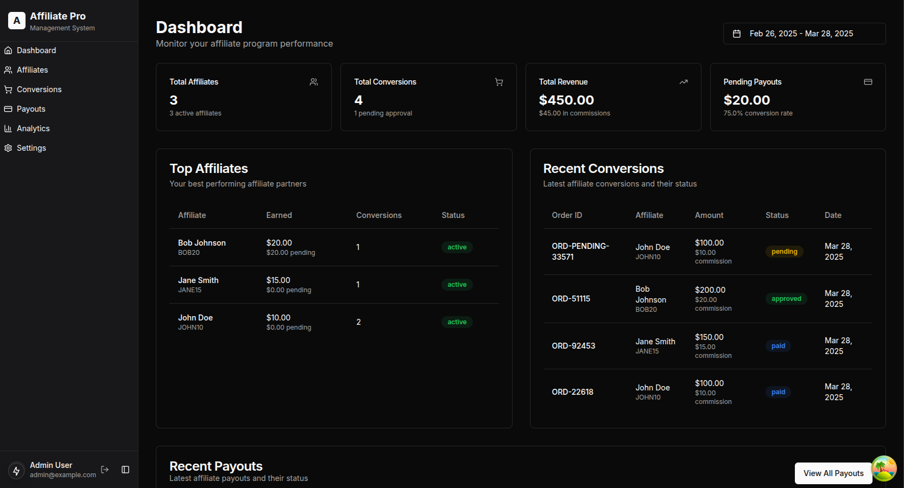

# Affiliate Commission System

A comprehensive platform for managing affiliate partnerships, tracking conversions, processing payments, and analyzing performance.



## 🌟 Features

- **Affiliate Management**: Register and manage affiliate partners
- **Conversion Tracking**: Monitor sales attributed to affiliates
- **Automated Payouts**: Process commission payments to affiliates
- **Performance Analytics**: Track revenue, conversion rates, and affiliate performance
- **Secure Payment Processing**: Integration with Payman API for reliable payments

## 🚀 Tech Stack

### Frontend
- **Framework**: Next.js 14 with App Router
- **UI Components**: Custom components built with Tailwind CSS and shadcn/ui
- **State Management**: React Query for server state
- **Forms**: React Hook Form with Zod validation
- **Authentication**: Custom auth context using cookies and JWT

### Backend
- **API Framework**: Next.js API Routes
- **Database**: MongoDB with Mongoose ODM
- **Authentication**: JWT with HTTP-only cookies
- **Payment Processing**: Integration with Payman API

## 📋 Prerequisites

- Node.js (v18 or later)
- pnpm (v8 or later)
- MongoDB instance (local or Atlas)
- Payman API account for payment processing

## 🛠️ Installation & Setup

1. **Clone the repository**

```bash
git clone https://github.com/yourusername/affiliate-commission.git
cd affiliate-commission
```

2. **Install dependencies**

```bash
pnpm install
```

3. **Environment Variables**

Create a `.env.local` file in the root directory with the following variables:

```env
MONGODB_URI=your_mongodb_connection_string
PAYMANT_API_KEY=your_payman_api_key
```

4. **Seed the Database (Optional)**

If you need test data, run the following command:

```bash
node lib/db/seed.js
```

5. **Run the Development Server**

Start the development server:

```bash
pnpm run dev
```

The application will be available at `http://localhost:3000`.

## 📚 Documentation

### API Documentation

- [Authentication API](docs/api-docs/auth-api.md)
- [Affiliates API](docs/api-docs/affiliates-api.md)
- [Conversions API](docs/api-docs/conversions-api.md)
- [Payouts API](docs/api-docs/payouts-api.md)
- [Analytics API](docs/api-docs/analytics-api.md)
- [Settings API](docs/api-docs/settings-api.md)
- [Dashboard API](docs/api-docs/dashboard-api.md)
- [Payment API](docs/api-docs/payment-api.md)

### Frontend Documentation

- [Architecture Overview](docs/frontend-docs/architecture.md)
- [Component Architecture](docs/frontend-docs/components.md)
- [Data Fetching Strategy](docs/frontend-docs/data-fetching.md)
- [Payment Integration](docs/frontend-docs/payment-integration.md)


## 🛡️ Security

- Use HTTPS for all API requests in production.
- Store sensitive data like API keys in environment variables.
- Use strong passwords and enable two-factor authentication for admin accounts.

## 🤝 Contributing

Contributions are welcome! Please follow these steps:

1. Fork the repository.
2. Create a new branch for your feature or bugfix.
3. Commit your changes and push the branch.
4. Open a pull request.


